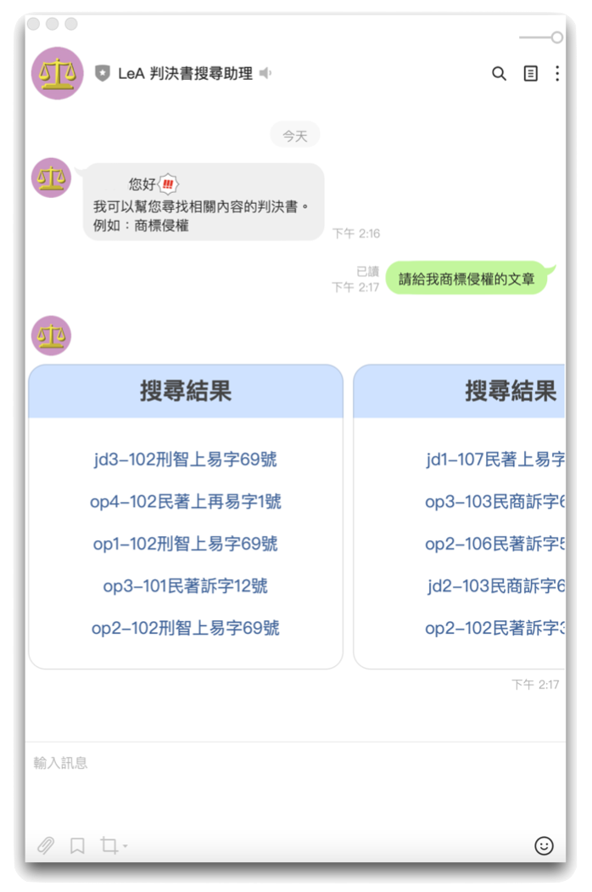

# LeA 判決書搜尋助理 

# 簡介

LeA, 或是 LEgal Assistant 是透過卓騰語言科技的文件搜尋系統的 CopyToaster 所製作的智慧判決書搜尋服務，是您最親切的線上助理，判決書搜尋助理 LeA 的特點是…

1. 根據使用者的搜尋習慣做個人化調整 - 您開啟過的搜尋結果排名將會提高！
2. 透過 **語意計算 (Semantic Computation)** 讓搜尋結果會更加符合使用者期待。 
3. 可連接不同 Chatbot System，如 LINE 或是 Telegram 讓搜尋更方便，也可以直接連接API，使用習慣也可以客製化。
4. 提供 API 可串接其它 Chatbot System 甚至可進一步處理做為後續應用的基礎。

---

# LeA 使用方法
操作方法有兩種，一是透過 API 連接，可做為其它應用的基礎；二是直接利用 LINE 開始使用。

1. [透過API 連接](#First)
2. [直接使用 Line 來查詢](#Second)

## <h1 id="First">透過 API 連接</h1>

使用 API 時，請參考下方 python code 並且在 `username` 以及 `copytoaster_key ` 並填入以下資訊

1. 在 `username` 的地方請輸入 `LegalTech2022`
2. 在 `copytoaster_key` 的地方請輸入 `xG69*bu66!FRj+tCqTw-J8^29aH+Ax`
3. 在 `input_str ` 中輸入想查找的詞彙或語句，例如
	- 輸入查詢詞彙：*商標侵權*
	- 輸入查詢語句：*請給我關於商標侵權的判決*

### API 範例程式：
    
```python
from requests import post

result = post("https://lea.droidtown.co/api", json={
    "username": "LegalTech2022",
    "copytoaster_key": "xG69*bu66!FRj+tCqTw-J8^29aH+Ax",
    "input_str": "請給我關於商標侵權的判決"
})
if result.status_code == 200:
    # Output
    """{
        "status": True,
        "msg": "Success!",
        "results": [{'title': 'op3-103民商訴字60號', 
		     'document': '當事人: 沈瑛偉, 張清浩律師, 香港商電視廣播有限公司, 李寶安, 謝樹藝律師\n統一域名紛爭解決政策）於103年12月11日作成專家決定書...', 
		     'url': 'https://lea.droidtown.co/b366a72a-e27b-42be-a1b8-22395d5b4666'},
		    {'title': 'op1-103民商上易字3號', 
		     'document': '當事人: 李姍昀, 莫詒文律師, 簡銘昱律師, 林欣儀, 謝燈妹, 郭雨嵐律師, 呂紹凡律師\n四、得心證之理由：\n（一）被上訴人是否有故意、過失侵害系爭商標...', 
		     'url': 'https://lea.droidtown.co/af1f8a29-fac4-4e1e-9631-69742e771aca'}
		     ...]
    }"""
    print(result.json())
```
 
     

## <h1 id="Second">使用 Line</h1>

1. 打開你手機上的 LINE.app 並掃描以下 QR code 啟用 LeA's Office
  
    
    
2. 接下來，每次要問 LeA 問題的時候，就直接寫出你的問題，例如 `請給我商標侵權方面的文章`

    

3. 搜尋結果中的 `jd` 表示為 "**裁判全文**"，其後的數字 `-3` 表示是全文中的第 3 部份。
4.  搜尋結果中的 `op` 表示為"**法院見解**"，其後的數字 `-4` 表示是全文中的第 4 部份。
